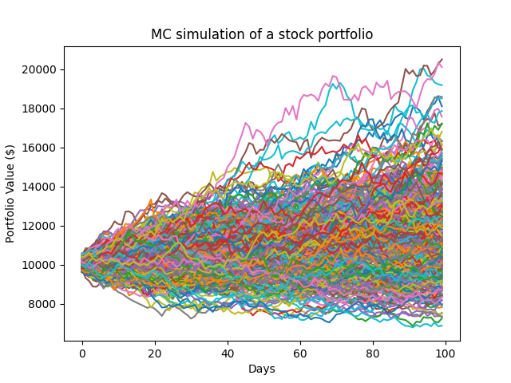

# Monte Carlo Simulation for Portfolio Risk Assessment

This project simulates the potential future performance of a stock portfolio using **Monte Carlo simulation** techniques. It provides visual and statistical insights into the risk associated with holding a portfolio of U.S. big-tech stocks.

---

## 🗂 Project Structure

```
├── requirements.txt
├── Monte Carlo Simulation_final.py
├── mc-simulation-big-tech.png
└── README.md
```

---

## 📦 Installation

1. **Clone this repository**

   ```bash
   git clone https://github.com/PhongTranlc/monte-carlo-portfolio-risk.git
   cd monte-carlo-portfolio-risk
   ```

2. **(Recommended) Create a virtual environment**

   ```bash
   python -m venv venv
   source venv/bin/activate   # On Windows: venv\Scripts\activate
   ```

3. **Install dependencies**

   ```bash
   pip install -r requirements.txt
   ```

---

## ▶️ How to Run the Simulation

Once dependencies are installed, run the simulation script:

```bash
python "Monte Carlo Simulation_final.py"
```

This script:

* Downloads historical stock data using `yfinance`
* Performs Monte Carlo simulations on a portfolio of U.S. tech stocks
* Calculates Value at Risk (VaR) and Conditional VaR (CVaR)
* Visualizes potential outcomes for the portfolio

---

## 📊 Sample Output

The simulation generates a visual output that looks like the following:



---

## 🧠 Requirements

* Python 3.8+
* Internet connection (for fetching financial data)
* Basic understanding of finance/statistics is helpful but not required

---

## 📬 Contact

For questions or contributions, feel free to open an issue or reach out.
